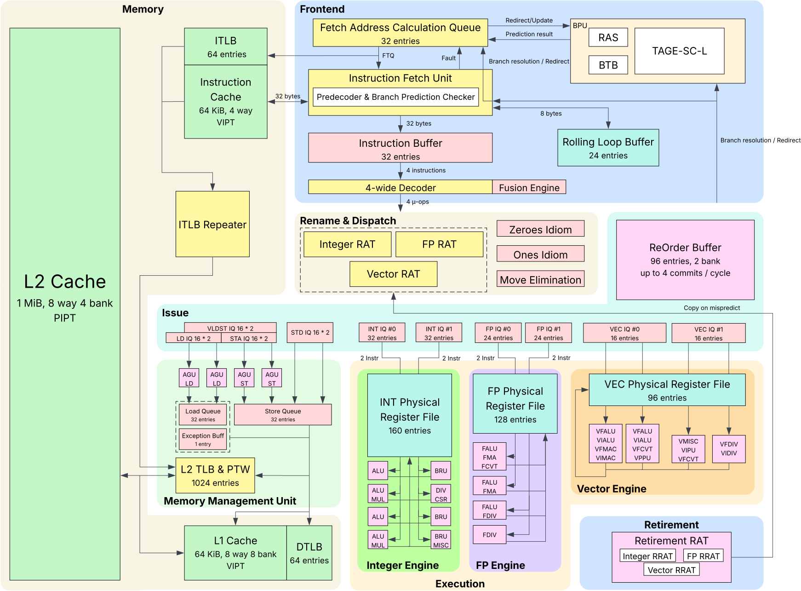

# Meteor G1

Meteor G1 is Meteorite's first generation of high performance RISC-V64 processors. It features the Meteo-RVef and Meteo-RVpf core microarchitectures.

# Architecture

> [!NOTE]
> The microarchitecture design of Meteor is still a Work In Progress, meaning anything could change at any moment.
> For now, only Meteo-RVef cores have a layout.

The microarchitecture of Meteo-RVef cores is the one shown below:

